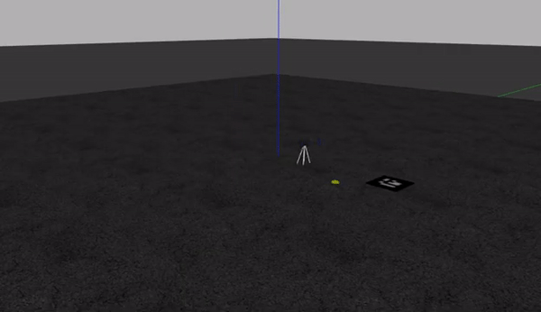

# Drone_simulation
Drone simulation using ROS, Gazebo and PX4

Drone landing on an AR marker

## Installing ArVar ROS Noetic 

You can build this repo from source.

In your workspace:(catkin_ws folder)

$ git clone https://github.com/machinekoder/ar_track_alvar.git -b noetic-devel

Build with colcon

$ colcon build

you can also just use catkin_make



## Using this repo

Add the package to your work space and `catkin_make`.

Don't forget to set the environment variables

### Launch the simulation world

`roslaunch shogime shogime.launch`

### Run the node

`rosrun shogime arucoland.py`

Make sure this file is executable `chmod +x arucoland.py` 

## Environment variables

```
px4_dir=~/Firmware
source /opt/ros/noetic/setup.bash
source ~/drone_ws/devel/setup.bash
source $px4_dir/Tools/setup_gazebo.bash $px4_dir $px4_dir/build/px4_sitl_default
export ROS_PACKAGE_PATH=$ROS_PACKAGE_PATH:$px4_dir
export ROS_PACKAGE_PATH=$ROS_PACKAGE_PATH:$px4_dir/Tools/sitl_gazebo
export GAZEBO_PLUGIN_PATH=$GAZEBO_PLUGIN_PATH:/usr/lib/x86_64-linux-gnu/gazebo-11/plugins
```
